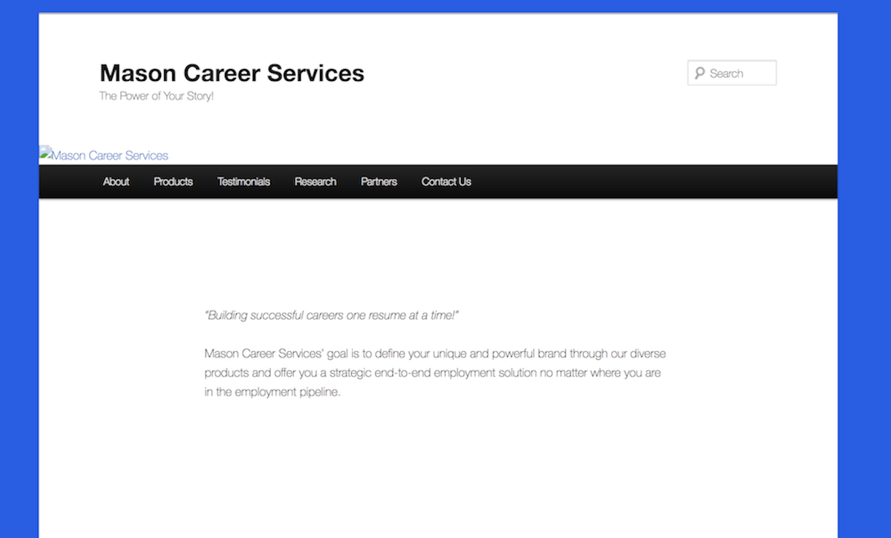
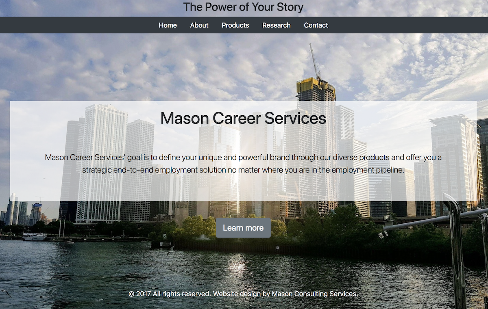
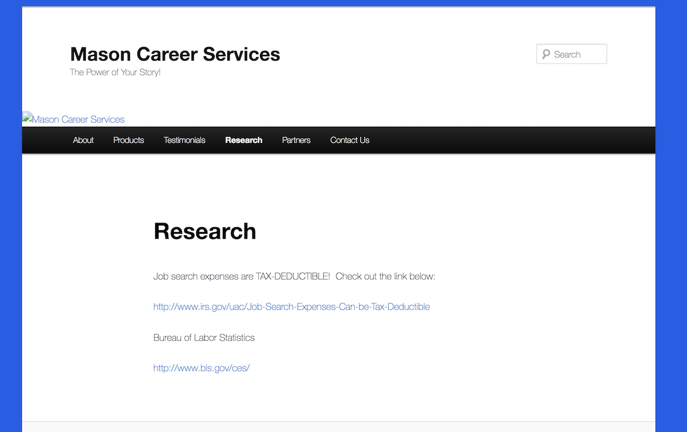
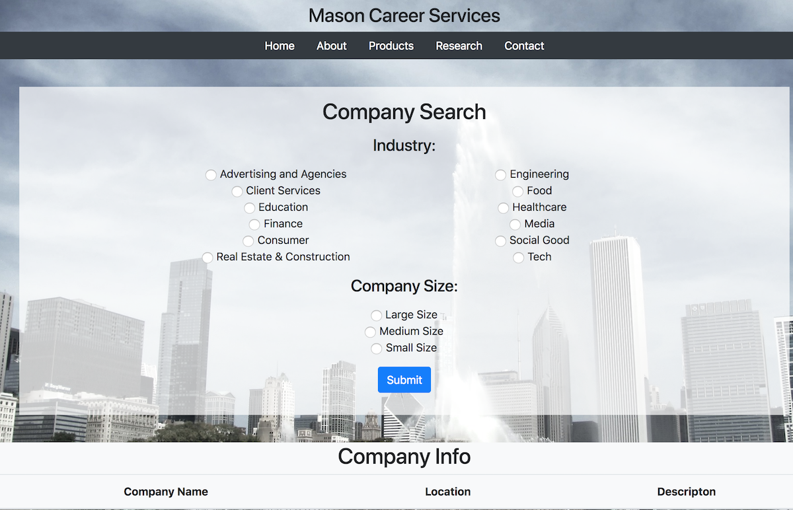

This website https://masoncareerservices-f22c6.firebaseapp.com is a redesign of an existing website, http://masoncareerservices.com/. 

 It includes a homepage, about, research, and contact.  The product page link is not active--it includes a shopping cart, which could be a project in the future.  The testimonials and partners pages were eliminated as they didn't appear to add value to the site.

The main difference is the addition of some styling.  Most of the content on the homepage, about, and contact pages are the same.  

The research page on the existing site is only a few links to outside resources. 

The new research page allows users to view company info pulled from The Muse API. (https://www.themuse.com/developers/api/v2) Users select an industry and a company size and receive a list of companies fitting the criteria along with company location data and a description. Unfortunately, some Industry selections do not contain data in the JSON file. (Notably, healthcare, size large, does not turn up any results.)

The contact sheet has name and email as required values, and local storage set on personal information values.